# P2P CNY settlement — WeChat Pay / Alipay demo (step by step)

Status: **built and captured**. Every screenshot below was taken from the real
wallet UI driving the real `p2p-engine` on 2026-10-09 by
`e2e/capture-p2p-cny.mjs` — two fresh wallets, one engine, no mocks.

Companion documents: [docs/p2pcny.md](../p2pcny.md) (design & threat model),
[docs/p2p.md](../p2p.md) (protocol), [docs/p2p-demo/p2p.md](p2p.md) (PayPal
demo guide), engine source `services/p2p-engine/src/`.

---

## 0. What this demo proves (read first)

1. **A CNY swap needs no API and no webhook.** The buyer transfers money to the
   seller's own WeChat/Alipay/bank account; the *seller's confirmation* is the
   fiat signal. The engine never touches CNY — it enforces
   `instructions → proof → confirm` and releases tokens only after payment was
   confirmed (by the seller, or by the admin arbiter after a dispute).
2. **The buyer cannot fake the money.** `PAYMENT_CLAIMED` is only the buyer's
   claim (流水号 + optional receipt image). Tokens stay locked until the seller
   signs `confirm` at `PAYMENT_CLAIMED` — the UI repeats this as a red warning
   above the *Confirm received* button.
3. **PII never reaches the order book or the chain.** `GET /public/orders`
   carries only the trade terms. The seller's 收款 account is revealed
   party-scoped by `POST /swaps/:id/payment-instructions`, and only a per-swap
   `remark` code plus (optionally) a receipt `sha256` are stored on the swap
   event.
4. **Rails are a data field, not a fork.** `wantRail ∈ {paypal, wechat,
   alipay, bank}` decides the whole fiat leg: PayPal keeps
   `payment_send`/`payout` (invoice + payout webhooks), the CNY rails use
   `instructions`/`proof`/`confirm`/`complete` (`state.ts:12-24`).
5. **Every mutating call is signed with the party's PQ (ML-DSA-87) `did:key`** —
   the same wallet key that signs chain transactions — over the sha256 of the
   canonical (sorted top-level keys) JSON body, plus a nonce + timestamp
   (±5 min): replay-protected, rate-limited to 10 signed requests per DID per
   minute (`sign.ts:17-19`). Classic Ed25519/secp256k1 dids still verify for
   compatibility, but new keys are PQ. The demo's final two steps — `release`
   and `complete` — are signed by the engine signer (`SETTLEMENT_ENGINE_DID`,
   an ML-DSA did:key ≈3.5 kB); nothing fires them automatically yet, so the
   capture script stands in for that operator job (§6.1).

---

## 1. State machine — who advances each step

| # | Status | Action (HTTP) | Who must sign | CNY-specific evidence |
|---|---|---|---|---|
| 1 | `MATCHED` | `POST /orders/:id/match` | buyer | `receiveAddress` (token payout address) |
| 2 | `ESCROW_LOCKED` | `POST /swaps/:id/transitions` `action=escrow_lock` | **seller** | `txHash` (escrow lock proof) |
| 3 | `PAYMENT_PENDING` | `POST /swaps/:id/payment-instructions` | buyer | `remark` (12 hex chars, per-swap) |
| 4 | `PAYMENT_CLAIMED` | `POST /swaps/:id/proof` | buyer | `txId` 流水号, optional `receipt` + `receiptSha256` |
| 5 | `PAYMENT_VERIFIED` | `POST /swaps/:id/confirm` | **seller** | the seller's own statement check |
| 6 | `ESCROW_RELEASED` | `POST /swaps/:id/transitions` `action=release` | **engine** | `txHash` (release proof) |
| 7 | `COMPLETED` | `POST /swaps/:id/transitions` `action=complete` | **engine** | — (seller already holds the CNY) |

Freeze paths: either party may `POST /swaps/:id/dispute` while
`PAYMENT_PENDING`/`PAYMENT_CLAIMED`; the admin then resolves with
`outcome=release|refund` (`server.ts:765-809`). `expire`/`refund`/`cancel` stay
available before release so a failed deal can always return the tokens.

---

## 2. The rails and how they are configured

| Rail (`wantRail`) | Buyer pays | Seller verifies | Tokens released by |
|---|---|---|---|
| `paypal` | PayPal invoice | PayPal webhook → `verify` | engine `payout` → `COMPLETED` |
| `wechat` | WeChat Pay to seller's WeChat ID | seller's own 流水 + remark | engine `release` + `complete` |
| `alipay` | Alipay to seller's account | seller's own 流水 + remark | engine `release` + `complete` |
| `bank` | bank transfer + remark | bank statement + remark | engine `release` + `complete` |

Engine environment (`services/p2p-engine/src/server.ts`):

```bash
SETTLEMENT_CNY_RAILS=wechat,alipay,bank  # unset → all three; "" → rail off
SETTLEMENT_CNY_REMARK_TTL=900            # seconds → payBy deadline in instructions
SETTLEMENT_ENGINE_DID=did:key:z446Gmp1… # ML-DSA-87 did:key (≈3.5 kB); only signer of release/complete/verify
SETTLEMENT_ENGINE_PUBKEY=050101010a20…  # prefixed ML-DSA pub (hex) → 2-of-3 escrow address derivation
SETTLEMENT_STORE=mem|pg                  # mem for demos, pg for production
SETTLEMENT_ADMIN_TOKEN=adm               # /orders, /swaps, dispute/resolve
CORS_ORIGIN=http://localhost:18081       # wallet web app origin
```

---

## 3. Running the demo yourself

```bash
# 1. workspace packages the engine imports
for pkg in did p2p-protocol record-sig; do ( cd packages/$pkg && npm run build ); done

# 2. engine bundle (esbuild → dist/server.bundle.mjs)
( cd services/p2p-engine && npm run build && npm run bundle )

# 3. wallet web app with the engine URL inlined by `expo export`
( cd expo-app && EXPO_PUBLIC_P2P_ENGINE_URL=http://localhost:18089 npm run web:build )
echo http://localhost:18089 > e2e/web-build/.p2p-url

# 4. capture: starts engine + web server, drives two fresh wallets end to end
node e2e/capture-p2p-cny.mjs        # KEEP=1 … leaves the servers running
```

The capture writes 14 numbered PNGs to
`docs/p2p-demo/assets/screenshots/` and a machine-readable run report to
`e2e/demo-output/p2p-cny-capture.json`. It is self-contained: no L0/L1, no
PayPal — a CNY swap has no chain-side dependency beyond the escrow lock proof
the engine skips when `deps.chain` is unset.

Run facts used in the screenshots below:

```json
{ "swapId": "swap-91748e19f7da5216", "txId": "420322BE2434E177",
  "remark": "910fc8a8926f", "capturedAt": "2026-10-09T07:39:57Z" }
```

---

## 4. Walkthrough

### Step 1 — Seller saves a collection profile

The seller opens **P2P → My swaps**, picks the rail (`wechat`), and enters the
收款 name and account (WeChat ID / Alipay account / card number). The profile is
stored server-side under the seller's DID and is **not** part of the public
order book — it is only revealed to the matched buyer by the instructions call.

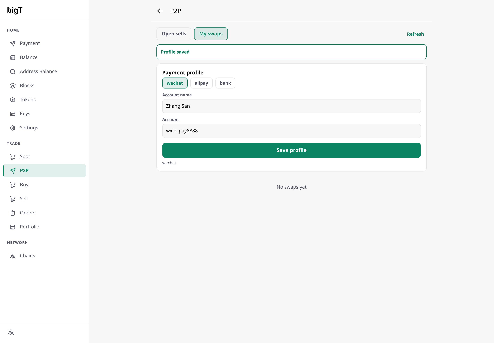

### Step 2 — Seller lists 10 USDT for 715 CNY on the wechat rail

**Open sells → List a sell order**: token `USDT`, amount `10`, price `715`,
currency `CNY`, chain `L0`, payment method **wechat** (selecting a CNY rail
switches the currency to CNY; `paypal` remains available for USD deals). The
signed `POST /orders` payload carries no PII:

```json
{ "sellerDid": "did:key:z446G…(ML-DSA did, ≈3.5 kB)", "giveToken": "USDT",
  "giveAmount": "10", "giveChain": "L0", "wantCurrency": "CNY",
  "wantAmount": "715", "wantRail": "wechat", "validUntil": 1791510000,
  "nonce": "…16+ chars…", "timestamp": 1791509100000,
  "signature": "…hex SignatureBundle over sha256(canonical JSON)…"}
```

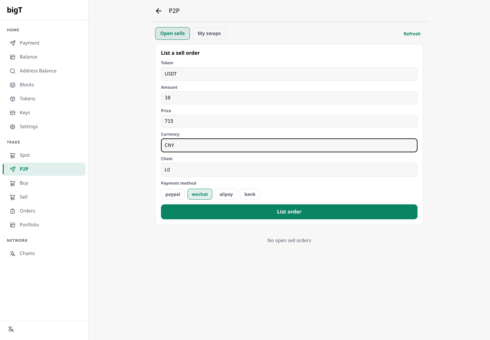

### Step 3 — Buyer matches the order

The buyer (fresh wallet, no profile needed) sees the order in **Open sells**
and opens the buy panel. On a CNY order the PayPal-only fields are **absent** —
`paypalAccount`/`buyerEmail` are not required (`server.ts:294`), only a receive
address is:

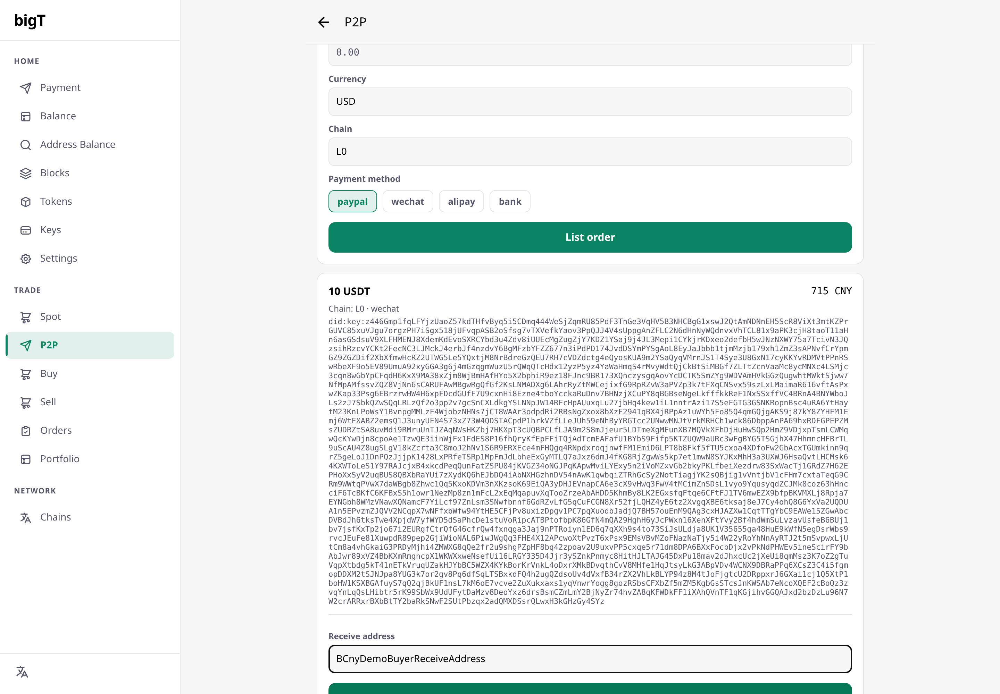

After **Confirm buy** the engine mints the swap at `MATCHED` and derives the
2-of-3 escrow address from the seller's and buyer's PQ dids plus the engine's
prefixed ML-DSA public key (`SETTLEMENT_ENGINE_PUBKEY`) — shown truncated on
the card:

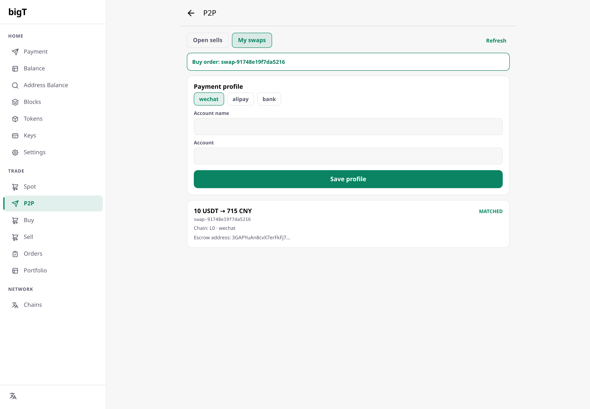

### Step 4 — Seller locks the token escrow

Back on the seller's **My swaps** tab, the seller pastes the escrow funding
transaction hash and presses **Lock escrow** — a seller-signed
`action=escrow_lock` transition. With `deps.chain` configured the engine
verifies the lock on chain; in the demo (`SETTLEMENT_STORE=mem`, no chain) it
is recorded as-is.

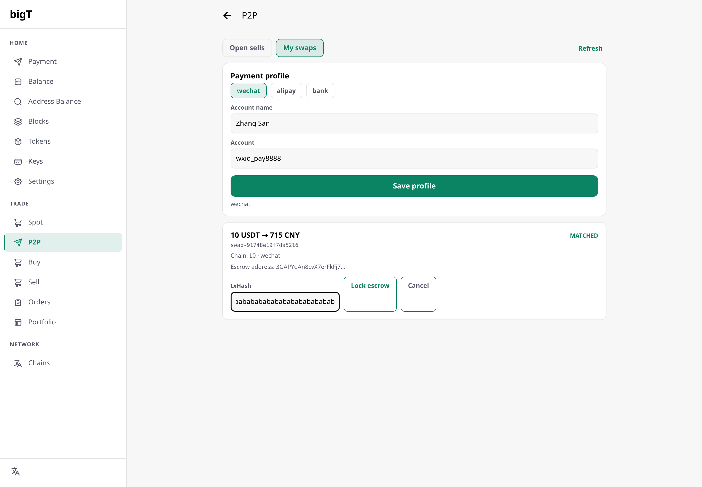

Status advances to `ESCROW_LOCKED`. **Nothing has been paid yet** — this is the
point of no return for the seller's tokens.

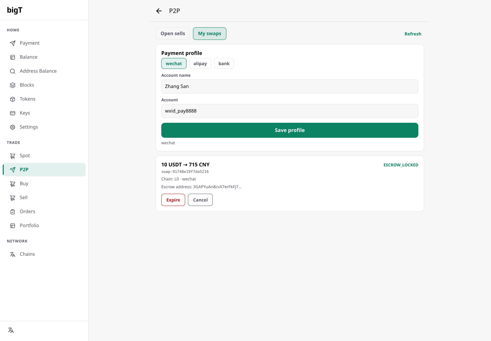

### Step 5 — Buyer pulls the signed payment instructions

The buyer's card now shows a **Payment details** button. Pressing it issues the
buyer-signed `POST /swaps/:id/payment-instructions`, which is idempotent while
`PAYMENT_PENDING` and reveals the seller's profile + a fresh per-swap `remark`
the transfer *must* carry:

```json
{ "method": "wechat", "rail": "wechat", "accountName": "Zhang San",
  "account": "wxid_pay8888", "amount": "715", "currency": "CNY",
  "remark": "0a42eb4b426c", "payBy": 1791510060 }
```

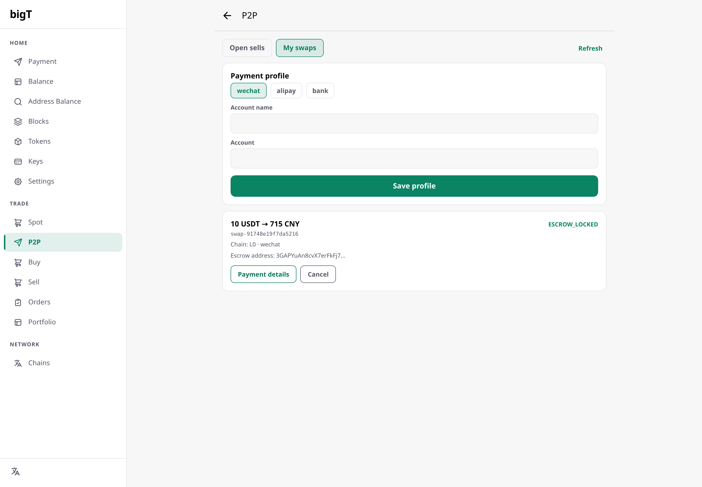

The instructions render **inline in the swap card** (amount, account, remark,
deadline) — plus an optional QR payload when the profile stores one:

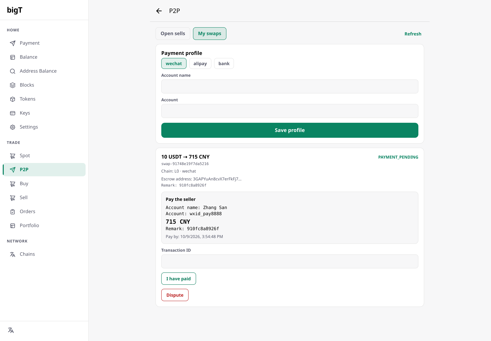

### Step 6 — Buyer pays in WeChat and claims with the 流水号

The buyer transfers `715 CNY` in their own WeChat app, pastes the transaction
number (流水号) into **Transaction ID**, and presses **I have paid**
(`POST /swaps/:id/proof`). The optional receipt image is stored as-is in the
proof store; only its `sha256` is anchored on the swap event.

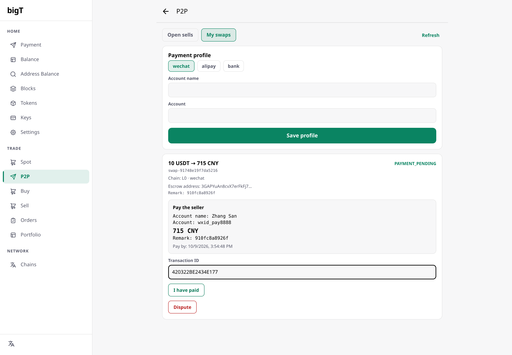

Status is now `PAYMENT_CLAIMED` — **the tokens are still locked.** This state
exists purely as the buyer's claim.

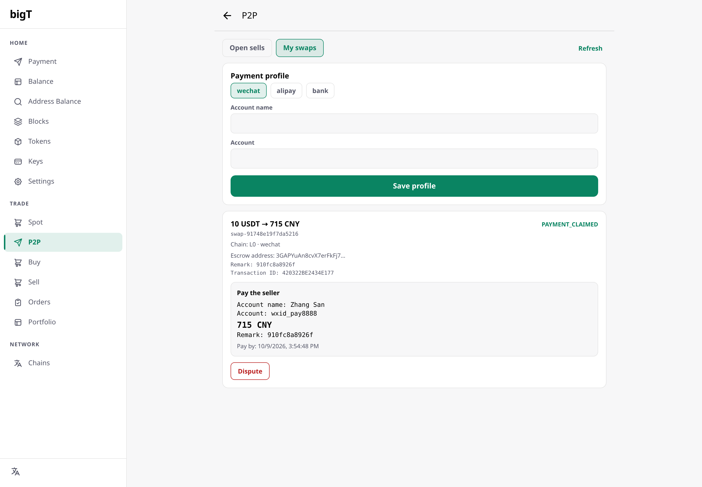

### Step 7 — Seller verifies on their own statement, then confirms

The seller's card shows the buyer's `流水号` and the remark. The seller checks
**amount + remark + time + 流水号 in their own WeChat account** (screenshots
never count), and only then presses **Confirm received** — a seller-signed
`POST /swaps/:id/confirm`. The red warning above the button is the whole safety
story of the CNY rail:

> Confirm only after the money is visible in your own account — this releases
> the tokens immediately.

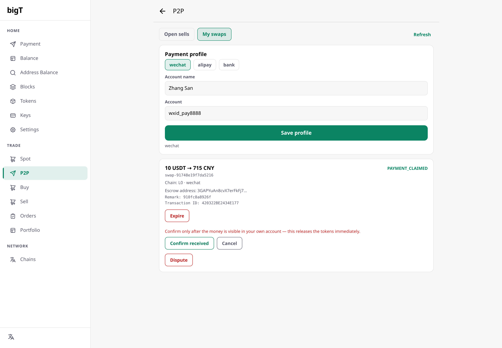

`PAYMENT_VERIFIED`:

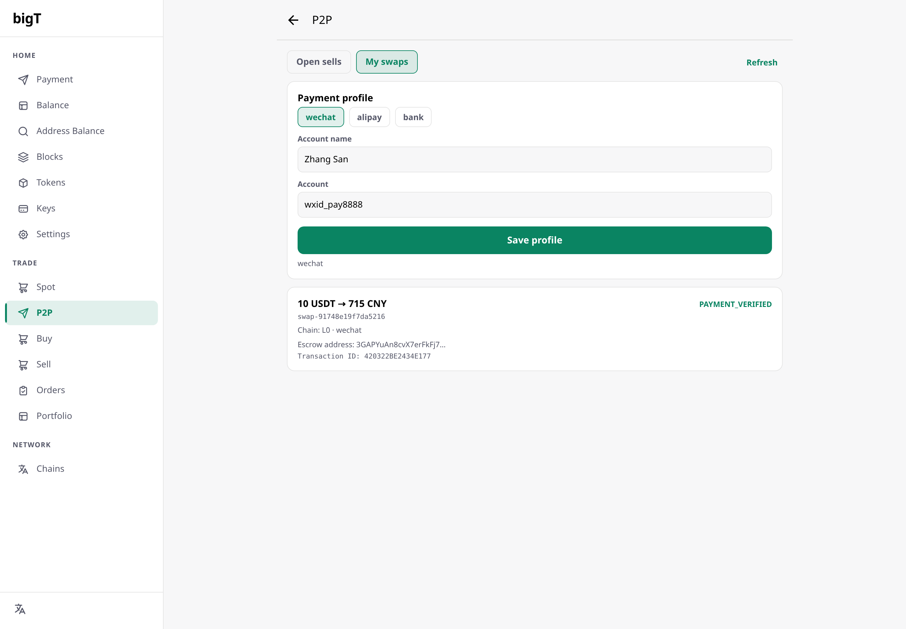

### Step 8 — Engine releases the tokens, swap completes

`release` and `complete` are engine-signed actions — the wallet deliberately
holds no key for them (see §6.1: nothing in the engine fires them
automatically yet). The capture script therefore stands in for the operator /
release job and signs both with the `SETTLEMENT_ENGINE_DID` key:

```bash
POST /swaps/swap-62d84d9fb89e9320/transitions   # did = engine, action=release, txHash=…
→ { "status": "ESCROW_RELEASED" }
POST /swaps/swap-62d84d9fb89e9320/transitions   # did = engine, action=complete
→ { "status": "COMPLETED" }
```

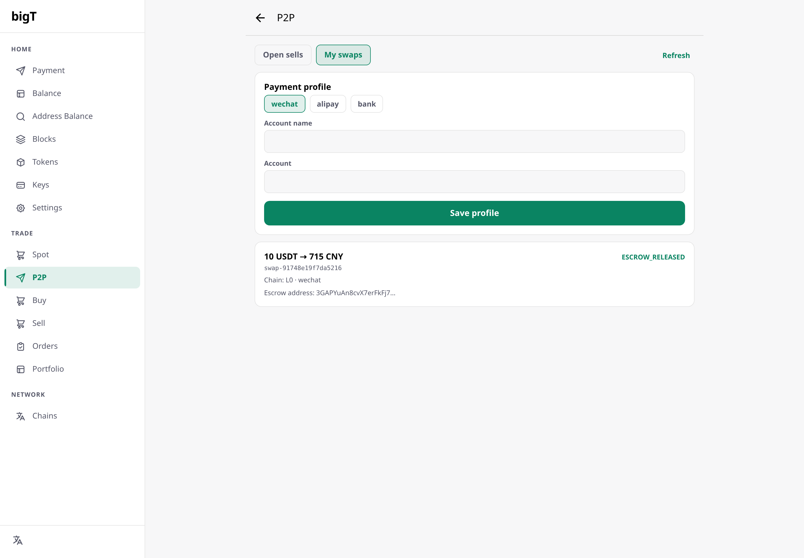

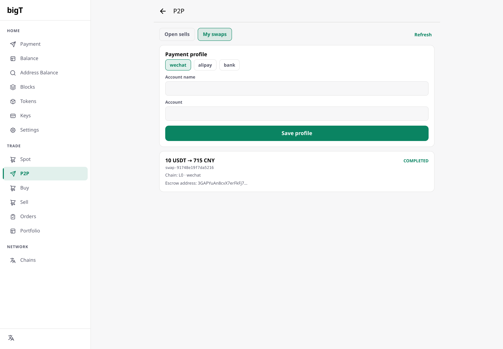

### Timeline of the captured run

| Time | Step |
|---|---|
| 07:38:23 | both wallets created |
| 07:38:27 | seller payment profile saved (wechat) |
| 07:38:31 | sell order listed (`wantRail=wechat`, 715 CNY) |
| 07:38:34 | buyer matched the order (no `paypalAccount` / `buyerEmail`) |
| 07:39:47 | escrow lock recorded (`ESCROW_LOCKED`) |
| 07:39:49 | buyer pulled payment instructions (户名 / account / 715 CNY / remark) |
| 07:39:51 | buyer claimed payment (流水号 `420322BE2434E177`) |
| 07:39:53 | seller confirmed receipt (`PAYMENT_VERIFIED`) |
| 07:39:53 | engine signed the release (`ESCROW_RELEASED`) |
| 07:39:55 | swap completed (`COMPLETED`) — seller already holds the CNY |

(The 70 s gap after matching is deliberate: the engine allows 10 signed
requests per DID per 60 s and the seller is at that ceiling after
profile + list + match.)

---

## 5. HTTP API reference (CNY rails)

All mutating endpoints take a signed body:

```jsonc
{ /* endpoint-specific fields, e.g. action / txId / … */
  "did": "did:key:z446G…",         // ML-DSA-87 did:key — the signer (see table §1)
  "nonce": "b1f0…",                // ≥16 chars, single use
  "timestamp": 1791509100000,      // ms, ±5 min (sign.ts NONCE_MAX_SKEW_MS)
  "signature": "…hex SignatureBundle…" }
```

`signature` = **PQ**: `SHA256(JSON.stringify(payload, sortedKeys))` signed with
the did's ML-DSA-87 key, hex-serialized `SignatureBundle` (`sign.ts:39-61`,
mirrors the wallet's `p2pIdentity.signP2pPayload`). A classic did instead
verifies an Ed25519 signature over the raw bytes, or an ECDSA signature over
their sha256 — supported for compatibility, not what new keys use. `payload`
is always the body **without** `signature`.

| Endpoint | Signer | Required fields | Success |
|---|---|---|---|
| `GET /healthz` | — | — | `{ ok: true }` |
| `GET /public/orders` | — | — | `{ orders: […] }` (no signature, no PII) |
| `POST /profiles` | seller | `method`, `accountName`, `account` (+`bankName`, `qr`) | `{ ok, method, updatedAt }` |
| `POST /profiles/mine` | seller | — | `{ profiles: […] }` |
| `POST /orders` | seller | `giveToken`, `giveAmount`, `giveChain`, `wantCurrency`, `wantAmount`, `wantRail`, `validUntil` | `201 { orderId, status }` |
| `POST /orders/:id/match` | buyer | `receiveAddress` (CNY: `paypalAccount`/`buyerEmail` not used) | `201 { swapId, status, escrowAddress }` |
| `POST /swaps/mine` | party | — | `{ swaps: […] }` |
| `POST /swaps/:id/transitions` | seller (lock/expire/refund) · either (cancel) · **engine** (release/complete/verify) | `action`, +`txHash` for lock/release | `{ swapId, status }` |
| `POST /swaps/:id/payment-instructions` | buyer | — | `201 { …instructions, remark, payBy }` |
| `POST /swaps/:id/proof` | buyer | `txId` (1..64 `[A-Za-z0-9._-]`), optional `remark`, `receipt`, `receiptSha256` | `{ swapId, status, txId, receiptSha256 }` |
| `POST /swaps/:id/confirm` | seller | — | `{ swapId, status: "PAYMENT_VERIFIED" }` |
| `POST /swaps/:id/dispute` | either party | optional `reason` (≤512) | `{ swapId, dispute }` |
| `POST /swaps/:id/dispute/resolve` | admin token | `outcome=release\|refund` | `{ swapId, … }` |

Guard rails the engine enforces on every one of them:

* `409` when the status transition is illegal (`state.ts` `VALID_TRANSITIONS`),
  `409` on a dedicated action sent to the generic route (`instructions`,
  `payment_proof`, `payment_confirm` are rejected there),
* `403` unless `did` is the required signer, `400` on bad signature, replayed
  nonce, stale timestamp, or `rate limit exceeded` (10/min/DID),
* `422 swap frozen: …` while a dispute is open for the forward actions,
* `400` for rail/action mismatches (`CNY swap: use …/proof`,
  `complete is for CNY swaps`).

---

## 6. Review findings (code review of the CNY implementation)

Verified good: the transition table keeps `PAYMENT_CLAIMED` out of the release
path; `release`/`complete` are engine-only; the profile is party-scoped; the
remark is regenerated per swap and checked on `proof`; the receipt hash is
recomputed server-side; unit tests cover the CNY legs
(`services/p2p-engine/test/cny.test.ts`, 54 engine tests green).

Open gaps, in the order they matter:

1. **No automatic release after `confirm`.** The engine does not issue
   `release`/`complete` itself when the seller confirms — an operator/cron must
   do it with the engine key. Today the wallet UI has no button for it either
   (by design: the wallet must not hold the engine key).
2. **`docs/p2pcny.md` was stale** — it still said "Status: plan — not built",
   documented the instructions route as `GET`, and allowed disputes from "any
   pre-release state". Corrected in this pass (status, `POST` route, dispute
   states `PAYMENT_PENDING`/`PAYMENT_CLAIMED`, `confirm` no longer claiming to
   broadcast the release); `SETTLEMENT_CNY_CONFIRM_TIMEOUT` and
   `SETTLEMENT_CNY_MAX_CENTS` are now marked *not implemented* in that doc.
3. **`payBy` is advisory.** The `SETTLEMENT_CNY_REMARK_TTL` deadline is returned
   to the buyer but never enforced — a swap can be claimed after it expires,
   and `SETTLEMENT_CNY_MAX_CENTS` / a confirm timeout are not implemented.
4. **`receiptSha256` hashed the data-URL string, not the image bytes** — fixed
   in this pass: `server.ts` decodes the `data:image/…;base64,…` payload and
   hashes the decoded bytes (400 on malformed base64), so the digest is
   reproducible with `sha256 <file>`; `test/cny.test.ts` asserts it.
5. **`Alert.alert` is a no-op on react-native-web** — every error/success
   message in the P2P screen (including the payment instructions) was invisible
   in the web build. Fixed in this pass: inline notice banner + inline
   instructions panel + confirm warning, localized in 12 languages
   (`p2p.payBy`, `p2p.confirmWarn`).
6. **Rate limit bites scripted flows.** 10 signed calls/DID/minute is tight for
   the wallet's own read-modify loops (`/swaps/mine` after every transition);
   the capture script has to pace itself. Worth making `RATE_LIMIT` an env knob
   if real users ever hit it.

---

## 7. Regenerating this guide

```bash
node e2e/capture-p2p-cny.mjs                 # refresh the 14 screenshots
node docs/p2p-demo/scripts/gen-p2p-cny-pdf.mjs
# → docs/p2p-demo/assets/p2p-cny.pdf
```

The generator is dependency-free (own markdown → HTML, images embedded as data
URIs, `chromium --headless --print-to-pdf`), the same pipeline the dai help
guides use.
